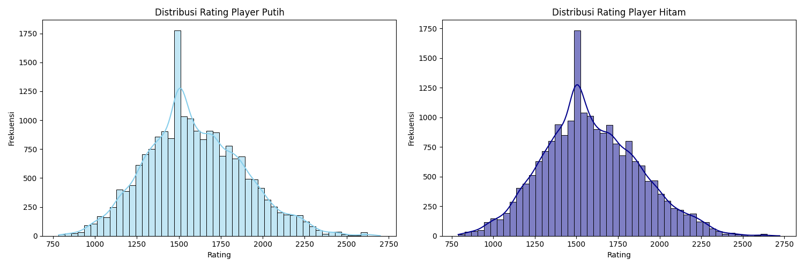
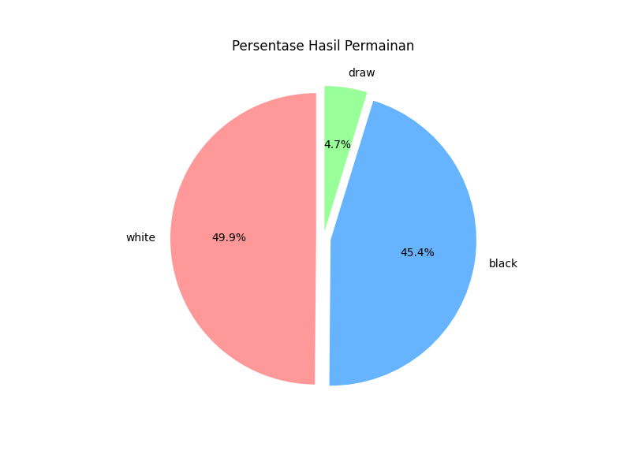
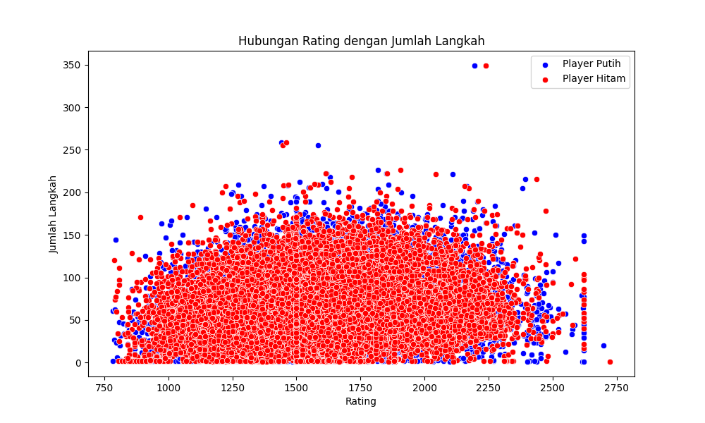
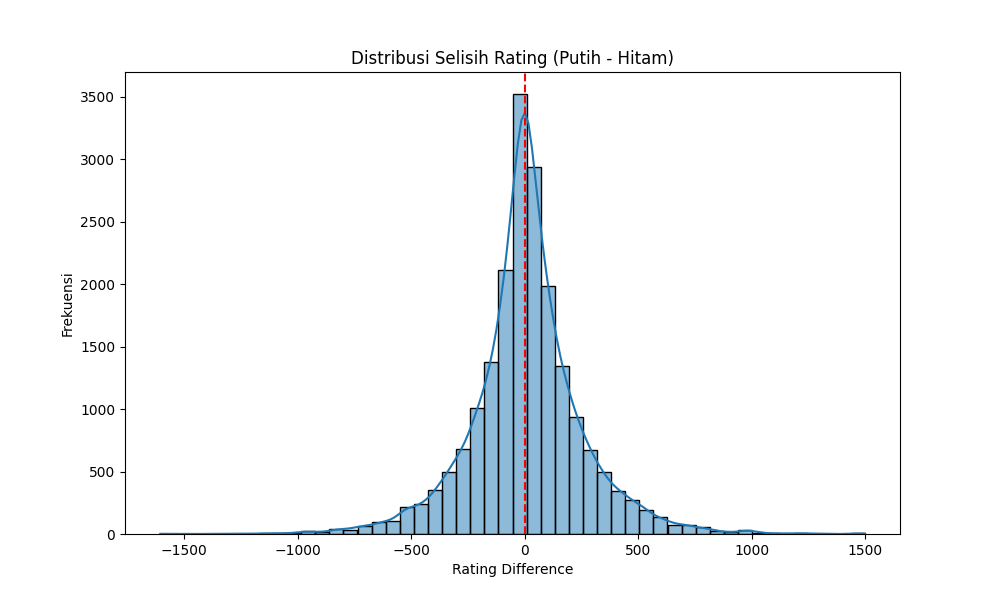
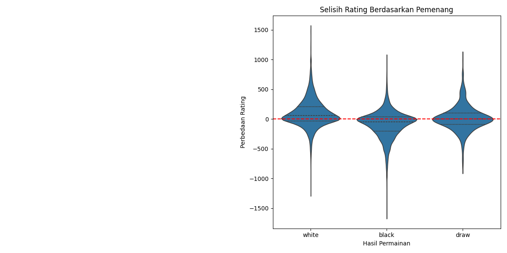

# Chess Game Analysis Project

[](https://python.org)
[](https://pandas.pydata.org)
[](https://opensource.org/licenses/MIT)

Proyek Data Analyst permainan catur ini fokus pada eksplorasi hubungan antara rating pemain, karakteristik permainan, dan hasil akhir. Berdasarkan analisis yang dilakukan, proyek ini mengungkap pola menarik dalam distribusi rating, strategi permainan, dan faktor penentu kemenangan.

## Tujuan Belajar
1. Menerapkan teknik analisis data menggunakan Python pada dataset permainan catur nyata
2. Mengeksplorasi hubungan antara rating pemain dengan karakteristik permainan
3. Mengidentifikasi pola kemenangan berdasarkan selisih rating pemain
4. Menganalisis pengaruh jumlah langkah terhadap hasil permainan
5. Membuat visualisasi data yang efektif untuk menyajikan temuan analisis
6. Mengembangkan kemampuan interpretasi statistik dalam konteks permainan strategi

## Struktur Proyek

chess-game-analysis/
├── data/ # Dataset permainan catur
│ └── games.csv # Koleksi permainan dalam format PGN
├── images/ # Visualisasi hasil analisis
│ ├── distribusi_rating.png
│ ├── hasil_permainan.png
│ ├── rating_vs_jumlah_langkah.png
│ ├── distribusi_selisih_rating.png
│ └── perbedaan_rating_vs_hasil.png
├── chessGame_analysis.ipynb # Notebook analisis utama
├── requirements.txt # Dependensi
└── README.md # Dokumentasi ini


## Analisis Utama

### 1. Analisis Distribusi Rating Pemain

- Distribusi rating pemain putih dan hitam
- Identifikasi rentang rating yang paling umum
- Perbandingan karakteristik pemain berdasarkan tingkat skill

### 2. Analisis Hasil Permainan

- Persentase kemenangan putih vs hitam
- Frekuensi hasil seri
- Hubungan antara tingkat skill dan hasil akhir permainan

### 3. Hubungan Rating vs Jumlah Langkah

- Korelasi antara rating pemain dan panjang permainan
- Apakah pemain dengan rating lebih tinggi cenderung menyelesaikan permainan lebih cepat?
- Pola jumlah langkah untuk berbagai tingkat skill

### 4. Distribusi Selisih Rating

- Sebaran perbedaan skill antara pemain putih dan hitam
- Frekuensi permainan dengan pemain setara vs tidak setara
- Pengaruh ketidakseimbangan skill terhadap dinamika permainan

### 5. Perbedaan Rating vs Hasil Permainan

- Pengaruh selisih rating terhadap peluang menang
- Prediksi hasil berdasarkan perbedaan skill
- Analisis kejutan ketika pemain dengan rating lebih rendah menang

## Dataset
Dataset berisi permainan catur yang dikumpulkan dari sumber:
- [Lichess Open Database](https://database.lichess.org/)
- [Chess Game Datasets](https://www.kaggle.com/datasets/datasnaek/chess)
- [Chess.com API](https://www.chess.com/news/view/published-data-api)

Karakteristik dataset:
- Format: PGN (Portable Game Notation) yang dikonversi ke CSV
- Jumlah permainan: 20,000+
- Variabel kunci: 
  - `white_rating`: Rating pemain putih
  - `black_rating`: Rating pemain hitam
  - `result`: Hasil permainan (1-0, 0-1, 1/2-1/2)
  - `moves`: Jumlah langkah dalam permainan
  - `time_control`: Jenis kontrol waktu

## Teknologi Digunakan
- **Python 3.10**
- **Pandas** - Pengolahan dan analisis data
- **Matplotlib & Seaborn** - Visualisasi data
- **Scikit-learn** - Analisis statistik
- **Jupyter Notebook** - Lingkungan analisis interaktif

## Cara Menjalankan

1. Clone repositori:
```bash
git clone https://github.com/mrMaula/chess-game-analysis.git
2. Install dependensi:
```bash
pip install -r requirements.txt
3. Jalankan notebook:
```bash
jupyter notebook chessGame_analysis.ipynb

## Kontribusi

Kontribusi terbuka! Silakan:

Fork proyek

Buat branch fitur (git checkout -b fitur-analisis)

Commit perubahan (git commit -m 'Tambahkan analisis baru')

Push ke branch (git push origin fitur-analisis)

Buat Pull Request

## License
This project is licensed under the MIT License - see the [LICENSE.txt](LICENSE.txt) file for details

© 2025 [M Ridho Maula] | Portofolio Data Analyst